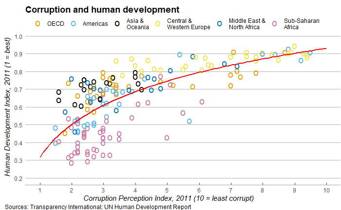

This plot, made with ggplot2, shows the correlation between the corruption perception index and the human development index of 173 countries. This is a reproduction, with small alterations, of a graph first published by [The Economist](https://www.economist.com/graphic-detail/2011/12/02/corrosive-corruption) in 2011. The raw data (CountriesData) comes from Transparency International and the UN. 

We altered the colours of the graph's points in order to make it more colour-blind friendly. The colour scheme was borrowed from a larger pallete found in [Cookbook for R](http://www.cookbook-r.com/Graphs/Colors_(ggplot2)/). Special thanks to my friend Eduardo for confirming that the colours used are indeed distinguishable by most colour-blind individuals.

